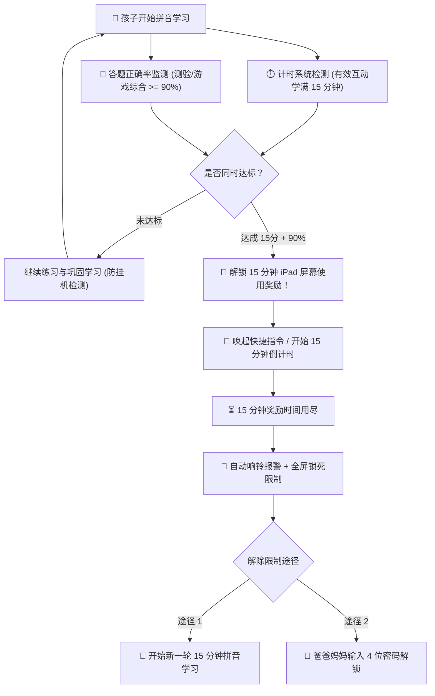

# 汉语拼音大冒险·统编人教版一年级上册同步学习乐园
### 🌟 专为一年级小学生与 iPad 屏幕时间激励管控深度定制

本项目紧密围绕**教育部统编人教版小学语文一年级上册**编写，涵盖教材中的**全部汉语拼音**与**识字表全部 300+ 中文生字**。针对孩子“喜欢玩 iPad、需要屏幕时间激励约束”的家庭真实教育场景，创新打造了**“学满 15 分钟 + 答题正确率 90% → 自动奖励 15 分钟屏幕时间 → 到期自动全屏锁定恢复限制”**的闭环激励体系。

---

## 🚀 核心功能亮点

### 1. 保证发音准确清晰，音量超大洪亮（专门解决 iPad 声音小通病）
- **Web Audio API 硬件级增益放大器（Boost 1.8x）**：串接动态压限器（DynamicsCompressor）与音量增益节点，大幅增强高频与人声穿透力，在 iPad 扬声器播放时音量足够大、清脆饱满且不破音。
- **强制系统最大音量与标准普通话发音映射**：Web Speech 引擎锁定 `volume = 1.0`，精准匹配人教版拼音呼读音（如 `b` 读玻、`p` 读坡、`d` 读得），确保字母、声调、整体认读与教材汉字发音 100% 准确地道。
- **语速可调与发音重复机制**：支持“正常语速”与“慢速拼读”一键切换，配有醒目的“🔊 播放发音”与“慢速再听一次”按钮。
- **iPad 触控无缝激活**：首次轻触屏幕即完成 AudioContext 与语音合成器的预热，避免 Safari 移动端音频静音或延迟。

---

### 2. 同步人教版一年级上册「全部拼音」大关卡
- **第二单元·拼音第一关**：第1课 `a o e`、第2课 `i u ü y w (yi wu yu)`、第3课 `b p m f`、第4课 `d t n l`。
- **第三单元·声母与平翘舌**：第5课 `g k h`、第6课 `j q x (小ü脱帽礼)`、第7课 `z c s (zi ci si)`、第8课 `zh ch sh r (zhi chi shi ri)`。
- **第四单元·复韵母与鼻韵母**：第9课 `ai ei ui`、第10课 `ao ou iu`、第11课 `ie üe er (ye yue)`、第12课 `an en in un ün (yuan yin yun)`、第13课 `ang eng ing ong (ying)`。
- 完整包含：**23个声母、24个韵母（单韵母、复韵母、特殊韵母、前后鼻韵母）、16个整体认读音节、四声调调号与标调口诀**。

---

### 3. 创新游戏：使用拼音练习教材全部 300+ 中文汉字
在全新的「🀄 汉字拼音乐园」中，完整收录教材识字表（天、地、人、你、我、他、金、木、水、火、土、日、月、山、石、田、禾、爸、妈、马、草、花、鸟、虫、秋、春、夏、冬、雪、风、云、雨等 300+ 常用字），设计了三大高趣味游戏模式：
1. **✨ 汉字拼音消消乐**：汉字卡与对应拼音卡配对连连看，手指轻触即播放标准普通话朗读与组词，两两配对成功化为金星消除！
2. **🎯 看汉字选拼音**：展示大字与教材同步组词，孩子听声辨音，在 4 个逼真的拼音选项中快速挑战！
3. **🍎 听音摘苹果**：系统朗读带调拼音，孩子在果树上寻找正确的生字苹果采摘，培养听觉记忆与汉字字形的瞬时反应！

---

### 4. 严谨的 iPad 屏幕时间激励与自动锁定闭环机制
针对孩子“看 iPad 停不下来”的痛点，量身打造科学的防沉迷激励机制：



- **解锁条件**：
  1. 本轮有效学习时长 **$\ge$ 15 分钟**（具备 60 秒挂机检测，防止孩子把网页开着不学）。
  2. 关卡测验与游戏答题正确率 **$\ge$ 90%**（且至少答满 10 道题，确保真正学懂掌握）。
- **奖励发放**：
  - 顶部指标条变为高亮翡翠绿，奖励按钮欢庆跳动，播放凯旋大合奏号角。
  - 点击后开启 **15 分钟倒计时（15:00 → 00:00）**，并可通过 URL Scheme 联动 iPad 快捷指令。
- **自动恢复锁定**：
  - 15 分钟到期后，系统立即鸣响**双音高亢警报闹铃**并播放温馨语音提示。
  - 网页弹出**全屏锁定覆盖层**，完全阻断游戏与操作。
  - 必须点击**“开始新一轮 15 分钟拼音挑战”**（重置计数器重新开始）或由家长在**触控小键盘输入 4 位管理密码（默认 1234，可自由修改）**方可解锁！

---

## 📱 iPad 屏幕时间与快捷指令（Focus Mode）深度联动教程

> [!TIP]
> 苹果 iOS / iPadOS 系统限制任何第三方网页直接强行更改系统的屏幕使用时间主密码。但您可以利用 **iPad 官方支持的「专注模式」与「快捷指令」**，实现**100% 自动锁定、自动隐藏游戏/视频 App、自动解禁 15 分钟并到期自动恢复锁定**：

### 方案：利用 iPad「专注模式」无缝自动管控（推荐！非常优雅）

#### 步骤 1：创建 iPad「拼音学习专注模式」
1. 拿起孩子的 iPad，打开 **「设置」** → **「专注模式」**。
2. 点击右上角 **「+」**，选择 **“自定”**，命名为 **“拼音学习”**，选一个可爱的书本图标。
3. 点击 **“允许的 App”**：选择 **“仅允许以下 App”**，列表中**只勾选 Safari 浏览器**（其余如抖音、微信、B站、游戏全部禁止）。
4. 保持该专注模式开启（此时 iPad 桌面上除 Safari 外，所有娱乐 App 均被系统强制隐藏或停用）。

#### 步骤 2：在 iPad「快捷指令」App 新建自动化
1. 在 iPad 上打开自带的 **「快捷指令」** App。
2. 点击右上角 **「+」** 新建一条快捷指令，将名称设为：`拼音奖励15分钟`。
3. 添加以下 3 个动作：
   - 动作 1：**设定专注模式** → 将“拼音学习”设为 **“关”**（此时桌面所有娱乐 App 瞬间全部解除隐藏！）。
   - 动作 2：**开始计时器** → 设置时长为 **15 分钟**。
   - 动作 3：**等待** 900 秒 → 接着添加 **设定专注模式**：将“拼音学习”设为 **“开”**（15 分钟一到，iPad 自动重新隐藏所有娱乐 App，锁回学习模式！）。

#### 步骤 3：与本学习网站完美联动
- 孩子在网页上学满 15 分钟且正确率达到 90% 后，点击网页上的 **“领取 15 分钟奖励”**。
- 网页会自动唤起 `shortcuts://run-shortcut?name=拼音奖励15分钟`。
- iPad 自动解除限制 15 分钟，计时结束后系统与网页同时双重自动锁死！

---

## 🖥️ 快速启动与使用方式

### 方式一：电脑直接双击打开
在 Mac 或电脑上直接找到 `index.html`，双击或右键选择 **Safari / Chrome / Edge** 打开即可。

### 方式二：在 iPad 上全屏畅玩（强烈推荐，体验最佳！）
让 Mac 和 iPad 处于**同一个 Wi-Fi（局域网）**下：

1. 在 Mac 终端运行本地 HTTP 服务：
   ```bash
   cd /Users/colin/Desktop/gemini/拼音学习网站
   python3 -m http.server 8080
   ```
2. 查看 Mac 局域网 IP（如 `192.168.1.100`）。
3. 拿起 **iPad 打开 Safari 浏览器**，输入地址：
   ```
   http://你的Mac局域网IP:8080
   ```
4. **添加到 iPad 主屏幕（沉浸式全屏 App）**：
   在 iPad Safari 顶部或底部点击 **“分享”图标（向上箭头）**，点击 **“添加到主屏幕”**。桌面上就会生成一个精美的“拼音大冒险”应用图标，点开即享受无地址栏的沉浸式全屏学习体验！

---

## 📂 项目文件架构一览

```
拼音学习网站/
├── index.html               # 主单页骨架（激励看板、地图、汉字乐园、实验室、锁定弹窗）
├── css/
│   └── style.css            # 儿童交互定制样式、iPad 触控优化、高亮发光动效与小键盘
├── js/
│   ├── pinyin-data.js       # 人教版 1-13 课完整拼音数据、音节表、声母/韵母/四声规则
│   ├── textbook-hanzi-data.js # 统编一年级上册识字表与写字表全套生字库（拼音、声调、组词）
│   ├── audio-engine.js      # 高保真普通话发音引擎、硬件增益放大（Boost 1.8x）、闹铃与号角
│   ├── stroke-canvas.js     # iPad 规范四线三格手指/Apple Pencil 描红板
│   ├── game-balloons.js     # 游戏1：气球派对（听音戳气球）
│   ├── game-train.js        # 游戏2：慢速拼读小火车（两拼慢滑助推器）
│   ├── game-tones.js        # 游戏3：声调过山车（四声小车爬坡）
│   ├── game-diff.js         # 游戏4：火眼金睛（b/d、p/q易混对决）
│   ├── game-hanzi.js        # 游戏5：汉字拼音乐园（消消乐、看字选音、听音摘苹果）
│   ├── screen-time-lock.js  # iPad 屏幕时间激励引擎（15分+90%正确率、倒计时、自动锁、快捷指令）
│   └── app.js               # 页面核心控制器、学情打卡、家长设置与关卡调度
└── README.md                # 完整技术与家教配置说明文档
```

祝小朋友拼音扎实、汉字识记快，快乐健康用屏幕！🎉
